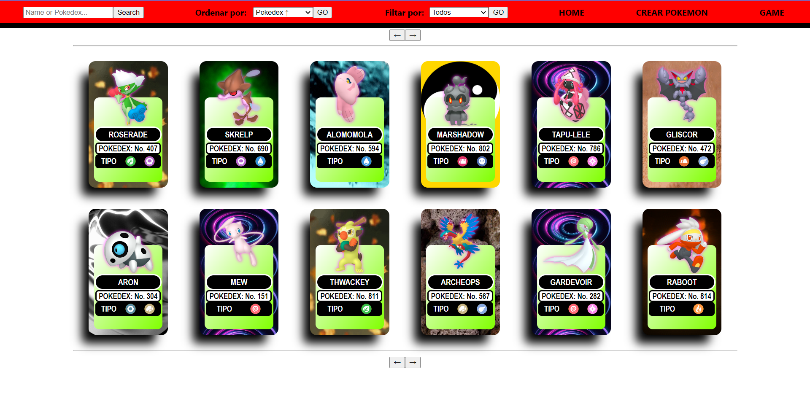
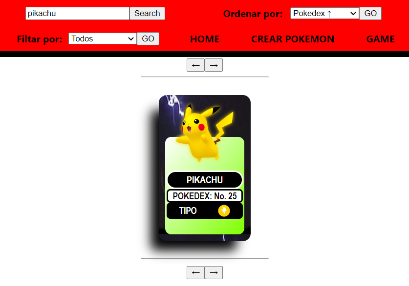
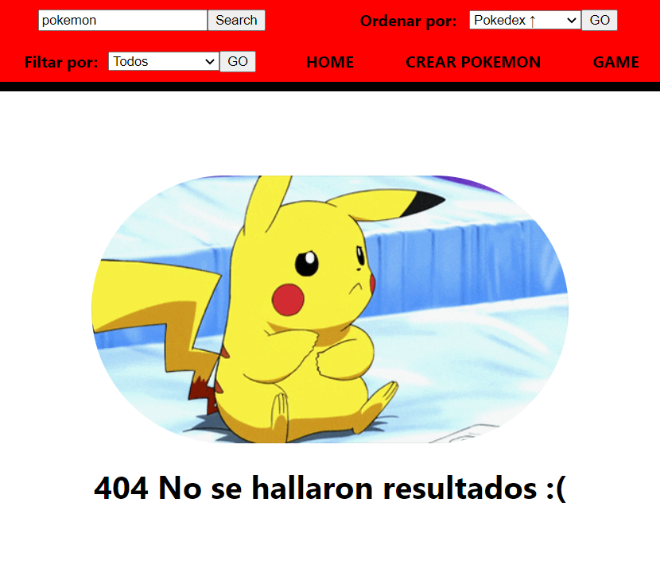
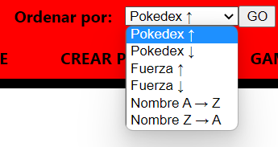
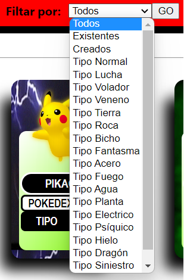
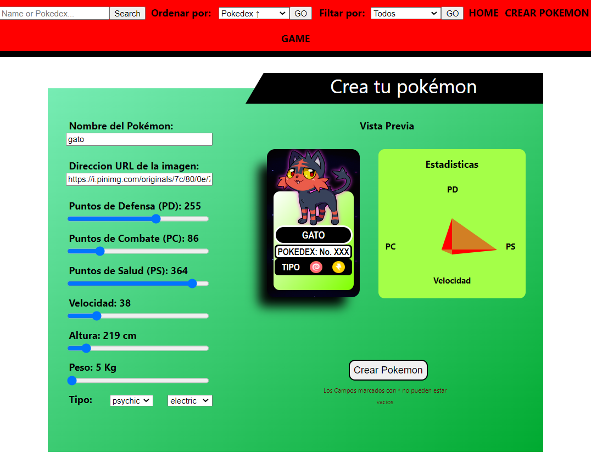
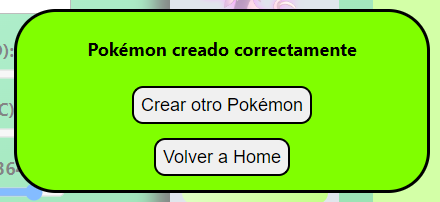

# Single Page Aplication Pokemon

  

## Descripcion

Este proyecto trata de una SPA (Single Page Aplication) que mediante el consumo de una API publica (https://pokeapi.co/), permite al usuario gestionar los datos de esta, para encontrar información referente a los diferentes Pokémon existentes en ella. Esta SPA permite, filtrar y organizar los 40 Pokémon que traemos inicialmente de la API, además permite crear nuevos Pokémon, dándole al usuario la libertad para poner las características que desee a su Pokémon. 

El reto para este proyecto fue la de crear una base de datos en la que se guarda la información de los datos correspondiente en la creación de nuevas cartas con Pokémon creados por el usuario, y adicionalmente también se creó un backend con nuevas rutas, para traer la información de la API indirectamente.

  

## Descripcion de cada vinculo en pantalla

- Boton Search 
 
Junto con el input, recibe texto alfanumerico, permitiendole al usuario escribir lo que guste, pero solo al dar click en el boton se mostrará en pantalla el resultado. Si es satisfactiro se visualizará la carta del Pokémon buscado, de lo contrario se mostrará un mensaje de resultado no hallado junto con una imagen, para tener exito en la busqueda, se debe escribir exactamente el nombre del Pokémon o el numero de su pokedex entre 1 - 898, solo los Pokémon creados por el usuario tendran un numero de pokedex superior al rango anterior.

 

  

  

- Ordenar Por: 

Permite organizar todas las cartas cargadas en dirente orden, entre: 
1. Pokedex ↑: ordena de forma ascendente las cartas tomando el numero de pokedex
2. Pokedex ↓: ordena de forma descendente las cartas tomado el numero de pokedex
3. Fuerza ↑: ordena de forma ascendente las cartas tomando el numero de fuerza del Pokémon
4. Fuerza ↓: ordena de forma descendente las cartas tomando el numero de fuerza del Pokémon
5. Nombre A → Z: ordena de forma ascendente las cartas tomando el nombre del Pokémon
6. Nombre Z → A: ordena de forma descendente las cartas tomando el nombre del Pokémon

  

- Filtrar Por: 

Permite mostrar solo las cartas que se seleccionen en el filtro, ya sea por: Pokémon traido de la API, Pokémon creados o por el tipo de cada Pokémon

  

- Crear Pokémon 

En esta sección, el usuario crea su Pokémon dándole las características que desee, entre rangos preestablecidos. Se trata de un formulario controlado en el que cada input es controlado en donde se informa si la información es valida para cada campo. Adicionalmente se muestra una vista previa de como va quedando la carta. Y finalmente al presionar el botón “Crear Pokémon”, mostrara un mensaje de creación correcta.

  

  

## Tegnologias Usadas

### Frontend
Toda la parte visual creada con:
- [ ] JavaScript
- [ ] React
- [ ] Redux

### Backend
Toda la parte de rutas para traer los datos a usar:
- [ ] JavaScript
- [ ] Express

### Data Base
La base de datos creada para almacenar los datos de los Pokémon creados por el usuario:
- [ ] JavaScript
- [ ] Sequelize - Postgres

